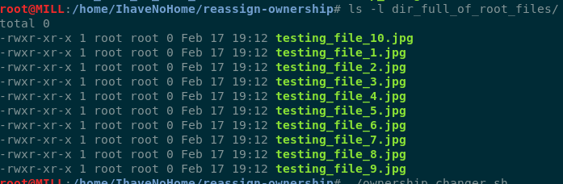
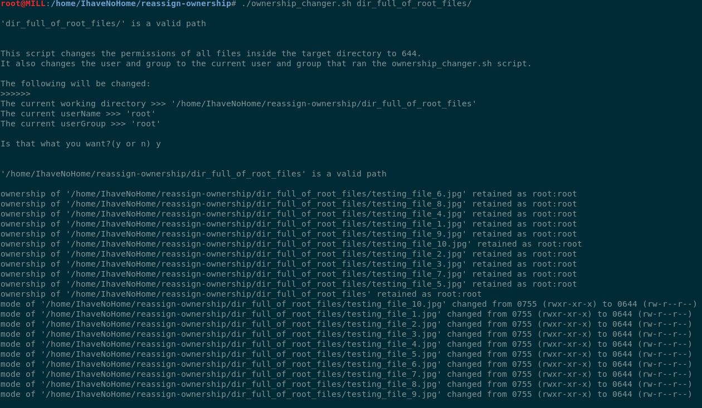
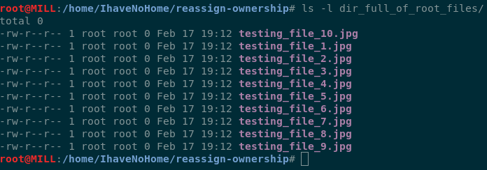

# reassign-ownership
Script to reassign ownership of files in target directory to that of the current user/group that ran the script.

## Before:

## During:

## After:

## Instructions
1) Clone the repository locally to your machine.
   - Open up terminal
   - Go to desired directory e.g. `cd ~\myNewDirectory`
   - Enter in `git clone https://github.com/ryanpaixao/iphoto-dirtree-to-flat-tree`
   
2) Go into newly cloned repository's directory
   - Enter in  `cd ./iphoto-dirtree-to-flat-tree`
   
3) Run the ownership_changer.sh script
   - Enter in `./ownership_changer.sh`   
     - A prompt will appear asking if you want go ahead and make the changes.
   - Enter in `y`
     - A prompt will appear asking you to enter in your root password
   - Enter in your root password
   
## Example
   - If the user is "DeeUser", and group is "DeeGroup"
   - And the files in /home/DeeUser/Pictures belong to 'root' user and group
   - Enter in `./ownership_changer.sh /home/DeeUser/Pictures`
   - The files will then belong to user "DeeUser" and group "DeeGroup" as well as have 644 permissions
